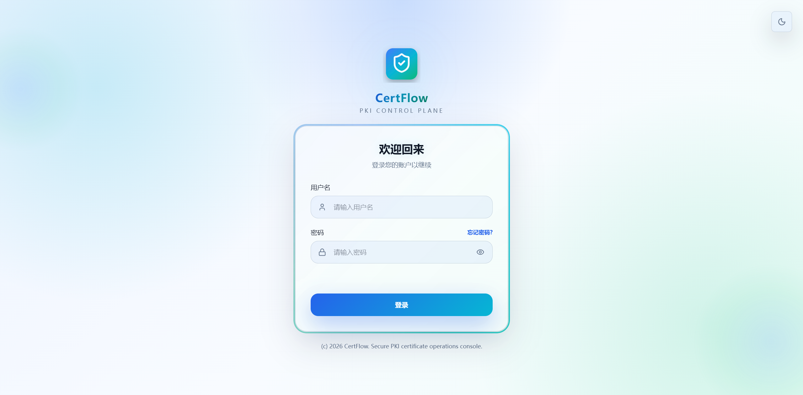
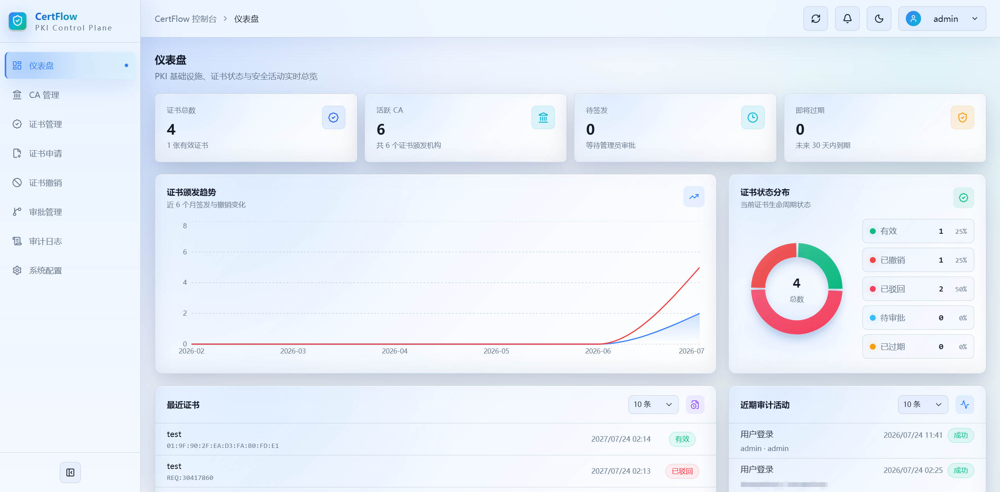

# CertFlow

CertFlow 是企业内部 PKI 证书生命周期管理平台。项目以 Go 后端和 React 运维控制台构建，覆盖 CA 分级、证书申请与审批、签发、撤销、CRL、OCSP、审计和 RBAC。

## 目录

- [一、项目介绍](#一项目介绍)
- [二、本地开发快速启动](#二本地开发快速启动)
- [三、Docker Compose 快速部署（推荐）](#三docker-compose-快速部署推荐)
- [四、生产环境部署](#四生产环境部署)
- [五、使用说明](#五使用说明)
- [六、安全说明](#六安全说明)
- [七、API 文档](#七api-文档)
- [八、版本历史](#八版本历史)
- [九、许可证](#九许可证)
- [十、致谢](#十致谢)
- [十一、联系方式](#十一联系方式)

# 一、项目介绍

## 1.1 项目简介

CertFlow 是面向企业内部服务的 PKI 证书生命周期管理平台。它由 Go 后端和 TanStack Start React 运维控制台组成，覆盖 CA 建立、证书申请、审批签发、下载、状态验证、撤销以及 CRL/OCSP 发布的完整闭环。

平台支持 Root、Intermediate 与 Issuing 三种 CA 类型，以及 X.509 证书、审批流、CRL、OCSP、RBAC 和审计等核心 PKI 能力。后端使用 PostgreSQL 保存平台用户、会话、CA、证书、审批、审计和系统配置，私钥、LDAP Bind Password 与 SMTP Password 均以应用主密钥加密后持久化。

平台面向需要自建内部信任体系的运维与安全团队。控制台读取数据库中的当前业务状态，不会在刷新浏览器时重新签发或修改证书；CA 创建、证书申请、审批、撤销、用户和认证配置等变更由后端执行权限校验并写入审计记录。

## 1.2 项目预览

|                 项目登录页                  |
| :-----------------------------------------: |
|  |

|                 项目首页                  |
| :---------------------------------------: |
|  |

## 1.3 核心功能

- **用户认证与访问控制**：支持本地账号、AD/LDAP 登录、会话与密码找回；角色和用户群组共同授权，后端逐接口校验。
- **审批、到期与续期通知**：支持邮件、Webhook、飞书、企业微信和钉钉。可按计划发送审批和到期提醒，并在续期窗口自动签发新证书；邮件按对应权限发送，Webhook 支持 POST、PUT、PATCH 和自定义请求头。
- **CA 管理**：支持创建或导入 Root、Intermediate、Issuing CA，以及 RSA、ECDSA、ED25519 算法；可查看和下载 PEM 证书并递归删除未关联的 CA 层级。
- **证书生命周期**：支持 Subject、SAN、用途、有效期和可选 CSR 的申请、审批签发、材料下载、状态校验、撤销与删除；系统生成模式会加密保存匹配私钥。
- **CRL 与 OCSP**：提供标准 X.509 CRL、RFC 6960 OCSP 和 JSON 状态查询；签发 CA 使用独立 OCSP Responder 签名，已撤销证书的状态历史可保留追溯。
- **审批与审计**：证书申请自动创建审批单；登录、CA、证书、审批、用户和系统配置等关键操作均记录审计日志。
- **系统配置**：集中配置品牌、PKI 参数、续期、用户与权限、LDAP 和邮件，并提供 LDAP 连通性及邮件发送测试。
- **API 文档**：集成 swag 和 Swagger UI，可通过 `/swagger/index.html` 查看接口、参数、鉴权和响应定义。

## 1.4 数据与安全边界

PostgreSQL 是平台业务数据的事实来源。私钥不会出现在 CA 或证书列表响应中；只有通过授权的证书材料下载接口才会返回私钥或 CSR。公开访问仅限 `/api/health`、`/api/v1/public/settings`、认证提供方、找回密码流程、`/crl/{caId}.crl`、`/ocsp`、`/ocsp/{serial}` 和 `/ocsp/health`，其余管理接口需要 Bearer Token，并由后端权限中间件验证。

## 1.5 技术栈

### 1.5.1 后端

- **语言**：Go 1.25+
- **HTTP**：Go 标准库 `net/http` 与 `ServeMux`
- **数据库**：PostgreSQL + pgxpool
- **认证与加密**：Bearer Token、AES-256-GCM、bcrypt、X.509 与 OCSP
- **API 文档**：swag + http-swagger

### 1.5.2 前端

- **框架**：React 19 + TanStack Router / TanStack React Start
- **语言与构建**：TypeScript + Vite
- **样式与组件**：Tailwind CSS、Radix UI、lucide-react、sonner

## 1.6 新手指南

- [CertFlow 新手证书签发与 Nginx 配置指南](<CertFlow新手证书签发与Nginx配置指南.md>)：从创建内部 CA、申请与审批业务证书，到部署 Nginx HTTPS 反向代理的完整操作流程。

## 1.7 项目结构

```bash
CertFlow/
├── backend/                 Go API、PKI 服务和 PostgreSQL 迁移
│   ├── api/router/          HTTP 边界、认证和权限校验、Swagger 注解与文档模型
│   ├── config/              环境变量加载与校验
│   ├── docs/                Swagger/OpenAPI 生成文件
│   ├── internal/            领域模型、仓储、安全和业务服务
│   ├── pkg/database/        PostgreSQL 连接、初始化与数据库迁移
│   └── cmd/server/          服务入口
├── deploy/                  Docker Compose、Nginx 与进程管理部署文件
├── frontend/                TanStack Start React 控制台
│   └── src/
│       ├── components/      应用布局、通知中心、弹窗与基础 UI
│       ├── features/        认证、PKI 业务、系统配置页面与角色编辑组件
│       ├── lib/             认证、PKI、系统配置 API 客户端与工具
│       ├── routes/          TanStack Router 路由薄层
│       ├── router.tsx       路由实例
│       ├── start.ts         React Start 入口
│       └── server.ts        服务端入口与错误处理
├── .dockerignore            Docker 构建忽略规则
├── .gitignore               Git 忽略规则
└── README.md                项目说明文档
```

# 二、本地开发快速启动

## 2.1 环境要求

- Go 1.25+（后端）
- Node.js 20+
- PostgreSQL 16+

> 如果本地没有安装部署 PostgreSQL，可参考以下docker快速部署相关数据库（可选）。

创建 `pgsql` 指令：

```bash
docker run -d --name pg-prod \
  -p 5432:5432 \
  -v /data/PgSqlData:/var/lib/postgresql/data \
  -e POSTGRES_PASSWORD="123456ok!" \
  -e LANG=C.UTF-8 \
  -e TZ=Asia/Shanghai \
  postgres:17-alpine
```

查看是否创建成功：

```bash
[root@docker-server ~]# docker ps
CONTAINER ID   IMAGE                COMMAND                  CREATED          STATUS          PORTS                                         NAMES
22205f8e78c6   postgres:17-alpine   "docker-entrypoint.s…"   34 minutes ago   Up 34 minutes   0.0.0.0:5432->5432/tcp, [::]:5432->5432/tcp   pg-prod
```

## 2.2 克隆项目

```bash
git clone https://github.com/zyx3721/CertFlow.git
cd CertFlow
```

## 2.3 数据库配置

### 2.3.1 本地数据库创建

创建 PostgreSQL 数据库：

```bash
psql -Upostgres -c "CREATE DATABASE certflow;"
```

### 2.3.2 容器数据库创建

进入容器内的 psql 交互界面：

```bash
docker exec -it pg-prod psql -U postgres
```

在 psql 中创建 `certflow` 库（执行后输入 `\q` 退出）：

```bash
CREATE DATABASE certflow;
```

## 2.4 后端配置与启动

> 如果没有配置go的镜像代理，可以参考 [Go 国内加速：Go 国内加速镜像 | Go 技术论坛](https://learnku.com/go/wikis/38122)。

1. 进入后端目录下载相关依赖：

```bash
cd backend
go mod download
```

2. 配置数据库连接等信息：

```bash
# 步骤1：复制模板文件
cp .env.example .env

# 步骤2：编辑 .env，配置数据库连接等信息
vim .env
# 服务配置
SERVER_HOST=localhost
SERVER_PORT=8080
SERVER_MODE=release
CORS_ORIGIN=http://localhost:5173

# 数据库配置
DB_HOST=localhost
DB_PORT=5432
DB_NAME=certflow
DB_USER=postgres
DB_PASSWORD=your_database_password
DB_SSLMODE=disable

# 登录与会话配置
JWT_SECRET=your_jwt_secret_key
JWT_EXPIRE_HOURS=24
SESSION_IDLE_TIMEOUT_HOURS=12

# PKI 私钥加密。生产环境必须提供 Base64 编码的 32 字节随机密钥
# 生成方式：openssl rand -base64 32
PKI_KEY_ENCRYPTION_KEY=
```

**配置参数说明详情见 [5.5](#55-后端配置)。**

3. 运行后端服务：

```bash
# 方式1：前台运行（终端关闭则服务停止）
go run cmd/server/main.go

# 方式2：后台运行（日志输出到 app.log）
nohup go run cmd/server/main.go > app.log 2>&1 &
```

后端服务默认运行在 `http://localhost:8080` ，如需指定地址和端口，请修改环境变量文件内的 `SERVER_HOST` 和 `SERVER_PORT` 参数。首次启动会自动创建数据库和默认管理员账户 `admin / 123456` 。

## 2.5 前端配置与启动

1. 进入前端目录下载相关依赖：

```bash
cd frontend
npm install
```

2. 配置 API 地址（可选）：

```bash
# 配置说明：
# - 后端端口 = 8080：无需创建 .env 文件（默认值为 http://127.0.0.1:8080）
# - 后端端口 ≠ 8080：需要创建 .env 文件（指定正确端口，例如后端端口改为 8090）
#   创建 .env 文件，例如：
echo "VITE_API_BASE_URL=http://127.0.0.1:8080" > .env
```

品牌配置直出说明（SSR）：

- 浏览器标签标题、收藏夹图标与启动加载页显示的品牌名称、图标，由前端 SSR 服务渲染时直连后端 `GET /api/v1/public/settings` 读取并直出 HTML，刷新页面不会再先闪现默认品牌再切换为自定义品牌
- SSR 服务读取品牌配置使用的后端地址同样取 `VITE_API_BASE_URL`（默认 `http://127.0.0.1:8080`）；后端暂时不可达时自动回退默认品牌，不影响页面打开

3. 启动前端服务：

```powershell
# 方式1：前台运行（终端关闭则服务停止）
npm run dev
# 如果要指定外部访问和监听端口，可执行例如：
npm run dev -- --host --port 5173

# 方式2：后台运行（日志输出到 certflow-frontend.log）
nohup npm run dev > certflow-frontend.log 2>&1 &
```

前端服务默认运行在 `http://localhost:5173/` 。

## 2.6 访问系统

- **首页**：`http://localhost:5173`
  - **默认用户名**：`admin`
  - **默认密码**：`123456`
- **API 文档**：`http://localhost:8080/swagger/index.html`

# 三、Docker Compose 快速部署（推荐）

## 3.1 部署目录结构

Docker Compose 部署相关文件统一放在 `deploy/` 目录下。`certflow` 单镜像内包含 Go 后端、Nginx 和前端 Nitro SSR 服务，并通过 Supervisor 管理多进程。

仓库内置文件结构：

```bash
deploy/
├── Dockerfile            # 多阶段镜像构建：前端构建、后端构建、运行时镜像
├── docker-compose.yml    # PostgreSQL 和 CertFlow 服务编排
├── entrypoint.sh         # 容器启动入口，交给 Supervisor 拉起各进程
├── nginx.conf            # 容器内 Nginx 配置，负责静态资源、API、SSE 和页面反代
├── supervisord.conf      # 容器内多进程管理配置
└── .env.example          # 环境变量模板
```

首次部署时需要从 `.env.example` 复制生成 `.env`，运行后会在 `deploy/` 下生成持久化目录：

```bash
deploy/
├── .env                  # 实际环境变量文件
├── CFData/               # CertFlow 应用数据挂载目录
│   └── logs/             # 后端与前端 SSR 运行日志
├── PgSqlData/            # PostgreSQL 数据目录，使用外部数据库时可不创建
```

镜像构建时会分别生成前端 `.output` 产物和后端二进制；运行时由 Supervisor 同时管理 Go 后端、Nginx 和前端 Nitro SSR 服务。

运行时只复制前端 `.output` 产物，并在 `/app/frontend` 执行 `node .output/server/index.mjs`。Nginx 直接托管 `.output/public/assets` 等静态资源，并将 `/api/`、`/api/events` 和 `/swagger/` 反向代理到后端。

## 3.2 准备配置文件

进入 `deploy` 目录，创建 `.env` 环境变量文件：

```bash
cd deploy
vim .env
```

`.env` 文件内容参考：

```bash
SERVER_MODE=release
CORS_ORIGIN=*

DB_HOST=postgres
DB_PORT=5432
DB_NAME=certflow
DB_USER=postgres
DB_PASSWORD=123456ok!
DB_SSLMODE=disable

JWT_SECRET=change-me-in-production
JWT_EXPIRE_HOURS=24
SESSION_IDLE_TIMEOUT_HOURS=12

# PKI 私钥加密。生产环境必须提供 Base64 编码的 32 字节随机密钥
# 生成方式：openssl rand -base64 32
PKI_KEY_ENCRYPTION_KEY=
```

**配置参数说明详情见 [5.5](#55-后端配置)。**

## 3.3 构建镜像（可选）

如果不想使用阿里云镜像仓库的镜像，可直接在本地手动构建（默认使用阿里云镜像仓库地址）：

```bash
# 在 deploy/ 目录下构建（构建上下文为项目根目录）
cd deploy
docker build \
  -f Dockerfile \
  -t certflow:latest \
  --build-arg ALPINE_MIRROR=mirrors.aliyun.com \
  ..
```

然后修改 `deploy/docker-compose.yml` 中 `certflow` 服务的 `image` 字段为 `certflow:latest`。

## 3.4 启动服务

`docker-compose.yml` 支持两种模式，按需选择：

**模式一：新建 PostgreSQL 容器（默认）**

首次启动会按 `.env` 中的 `DB_NAME` 自动创建数据库，默认数据库名为 `certflow`：

```bash
cd deploy
docker compose up -d
```

**模式二：使用已有容器**

`.env` 环境变量文件中确保数据库配置填入已有容器地址，并编辑 `deploy/docker-compose.yml`：

1. 注释掉 `postgres` 服务块
2. 注释掉 `certflow.depends_on` 块

```bash
cd deploy
docker compose up -d
```

## 3.5 服务管理

```bash
# 查看服务状态
docker compose ps

# 查看实时日志
docker compose logs -f certflow

# 重启 certflow 服务
docker compose restart certflow

# 停止所有服务
docker compose down

# 停止并删除数据卷（谨慎！数据会丢失）
docker compose down -v
```

## 3.6 访问系统

服务启动后，访问以下地址：

- **首页**：`http://your-domain.com`
  - **默认用户名**：`admin`
  - **默认密码**：`123456`
- **API 文档**：`http://your-domain.com/swagger/index.html`
- **健康检查**：`http://your-domain.com/health`

## 3.7 宿主机 Nginx 反代（可选）

如需通过宿主机 Nginx 统一配置公网域名、HTTPS 证书或多站点入口，可将 `deploy/docker-compose.yml` 中的端口映射改为非 80 端口（如 `8080:80`），再由宿主机 Nginx 反向代理到容器内 Nginx。

此时请求链路为：

```text
浏览器 -> 宿主机 Nginx -> certflow 容器内 Nginx -> Go 后端 / 前端 SSR 服务
```

### 3.7.1 HTTP 示例

```nginx
server {
    listen 80;
    server_name your-domain.com;

    # 限制上传文件大小（可选）
    client_max_body_size 50m;

    # 日志配置
    access_log /usr/local/nginx/logs/certflow-access.log;
    error_log /usr/local/nginx/logs/certflow-error.log warn;

    location / {
        proxy_pass http://127.0.0.1:8080;
        proxy_http_version 1.1;
        proxy_set_header Upgrade $http_upgrade;
        proxy_set_header Connection "upgrade";
        proxy_set_header Host $host;
        proxy_set_header X-Real-IP $remote_addr;
        proxy_set_header X-Forwarded-For $proxy_add_x_forwarded_for;
        proxy_set_header X-Forwarded-Proto $scheme;

        # 超时配置
        proxy_connect_timeout 600s;
        proxy_send_timeout 600s;
        proxy_read_timeout 600s;
    }
}
```

### 3.7.2 HTTPS 示例

> HTTPS 示例（含 80→443 跳转，请替换证书路径）：

```nginx
# HTTP 80端口配置，自动重定向到HTTPS
server {
    listen 80;
    server_name your-domain.com;   # 修改为你的域名/主机名，例如：certflow.cn
    return 301 https://$host$request_uri;
}

# certflow 站点 HTTPS 配置
server {
    # listen 443 ssl http2;  # Nginx 1.25 以下版本写法
    listen 443 ssl;
    http2 on;
    server_name your-domain.com;   # 修改为你的域名/主机名，例如：certflow.cn

    # 证书路径（替换为实际证书文件）
    ssl_certificate     /usr/local/nginx/ssl/your-domain.com.pem;  # 例如：/usr/local/nginx/ssl/certflow.cn.pem
    ssl_certificate_key /usr/local/nginx/ssl/your-domain.com.key;  # 例如：/usr/local/nginx/ssl/certflow.cn.key

    # SSL安全优化
    ssl_protocols              TLSv1.2 TLSv1.3;
    ssl_prefer_server_ciphers  on;
    ssl_ciphers                ECDHE-RSA-AES256-GCM-SHA512:DHE-RSA-AES256-GCM-SHA512:ECDHE-RSA-AES256-GCM-SHA384:DHE-RSA-AES256-GCM-SHA384;
    ssl_session_timeout        10m;
    ssl_session_cache          shared:SSL:10m;

    # 限制上传文件大小（可选）
    client_max_body_size 50m;

    # 日志配置
    access_log /usr/local/nginx/logs/certflow-access.log;
    error_log /usr/local/nginx/logs/certflow-error.log warn;

    location / {
        proxy_pass http://127.0.0.1:8080;
        proxy_http_version 1.1;
        proxy_set_header Upgrade $http_upgrade;
        proxy_set_header Connection "upgrade";
        proxy_set_header Host $host;
        proxy_set_header X-Real-IP $remote_addr;
        proxy_set_header X-Forwarded-For $proxy_add_x_forwarded_for;
        proxy_set_header X-Forwarded-Proto $scheme;

        # 超时配置
        proxy_connect_timeout 600s;
        proxy_send_timeout 600s;
        proxy_read_timeout 600s;
    }
}
```

# 四、生产环境部署

## 4.1 克隆项目

```bash
git clone https://github.com/zyx3721/CertFlow.git /data/certflow
cd /data/certflow
```

## 4.2 后端构建与配置

1. 进入后端目录下载相关依赖：

```bash
cd backend
go mod download
```

2. 配置数据库连接等信息：

```bash
# 步骤1：复制模板文件
cp .env.example .env

# 步骤2：编辑 .env，配置数据库连接等信息
vim .env
# 服务配置
SERVER_HOST=localhost
SERVER_PORT=8080
SERVER_MODE=release
CORS_ORIGIN=http://localhost:5173

# 数据库配置
DB_HOST=localhost
DB_PORT=5432
DB_NAME=certflow
DB_USER=postgres
DB_PASSWORD=your_database_password
DB_SSLMODE=disable

# 登录与会话配置
JWT_SECRET=your_jwt_secret_key
JWT_EXPIRE_HOURS=24
SESSION_IDLE_TIMEOUT_HOURS=12

# PKI 私钥加密。生产环境必须提供 Base64 编码的 32 字节随机密钥
# 生成方式：openssl rand -base64 32
PKI_KEY_ENCRYPTION_KEY=
```

**配置参数说明详情见 [5.5](#55-后端配置)。**

3. 构建后端可执行文件：

```bash
go build -o certflow-backend cmd/server/main.go
```

4. 运行后端服务：

```bash
# 方式1：前台运行（终端关闭则服务停止）
./certflow-backend

# 方式2：后台运行（日志输出到 app.log）
nohup ./certflow-backend > app.log 2>&1 &

# 方法3：加入 systemd 管理启动运行
# 服务配置参考如下，请自行修改相应目录路径
cat > /etc/systemd/system/certflow-backend.service <<EOF
[Unit]
Description=CertFlow Backend Golang Service
After=network.target network-online.target
Wants=network-online.target

[Service]
Type=simple
WorkingDirectory=/data/certflow/backend
ExecStart=/data/certflow/backend/certflow-backend
Restart=on-failure
RestartSec=5
LimitNOFILE=65535
StandardOutput=journal
StandardError=journal
SyslogIdentifier=certflow-backend

[Install]
WantedBy=multi-user.target
EOF

# 重载服务配置并启动
systemctl daemon-reload
systemctl start certflow-backend

# 设置开机自启
systemctl enable --now certflow-backend
```

## 4.3 前端构建与配置

1. 进入前端目录下载相关依赖：

```bash
cd frontend
npm install
```

2. 构建前端项目：

```bash
npm run build
```

构建产物在 `.output` 目录。当前前端使用 TanStack React Start + Nitro，构建后会生成可直接运行的 Node 服务端入口和静态资源目录：

- `.output/server/index.mjs`：生产环境 Node SSR 入口；
- `.output/public/`：浏览器静态资源，包含 JS、CSS、favicon 等文件；
- 生产环境页面 `/api/` 请求统一通过 Nginx 反向代理到后端；
- 前端 SSR 服务渲染首屏时会按 `VITE_API_BASE_URL`（默认 `http://127.0.0.1:8080`）直连后端读取品牌配置并直出标题、图标与启动页，后端不在该地址时需通过该变量指定。

因此生产部署时需要先启动 `.output/server/index.mjs`，再由 Nginx 将页面请求反向代理到该前端服务；不要只把 `.output/public` 配置为 Nginx 静态根目录，否则服务端渲染页面无法正常返回。

3. 启动前端 SSR 服务：

```bash
# 方式1：前台运行（终端关闭则服务停止）
HOST=127.0.0.1 PORT=5173 npm run start

# 方式2：后台运行（日志输出到 certflow-frontend.log）
nohup env HOST=127.0.0.1 PORT=5173 npm run start > certflow-frontend.log 2>&1 &

# 后端不在本机 8080 时，可同时指定 SSR 读取品牌配置的后端地址（无需重新构建）：
VITE_API_BASE_URL=http://192.168.1.10:8080 HOST=127.0.0.1 PORT=5173 npm run start
```

## 4.4 配置Nginx反向代理

在服务器上准备前端目录（例如 `/data/certflow/frontend/.output`），**将本地 `.output` 目录中的所有文件和子目录整体上传到该目录**，保持 `public/` 与 `server/` 结构不变，例如：

```bash
/data/certflow/frontend/.output/
├── public/
│   ├── assets/             # 前端浏览器端 JS/CSS 静态资源
│   └── favicon.svg         # 站点图标
└── server/
    └── index.mjs           # Nitro 生产 SSR 入口
```

上传完成后，在 `.output` 所属的前端项目目录执行 `HOST=127.0.0.1 PORT=5173 npm run start` 启动前端服务。Nginx 的 `/` 请求应反向代理到该服务，例如下方示例中的 `127.0.0.1:5173`；`/api/` 和 `/swagger/` 仍反向代理到 Go 后端 `127.0.0.1:8080`。

`/assets/` 与 `/favicon.svg` 可以由 Nginx 直接读取 `.output/public` 返回，避免静态资源经过前端 SSR 服务，并可为带 hash 的构建资源启用长期缓存。`/crl/`、`/ocsp` 与 `/ocsp/` 必须直接反向代理到 Go 后端，保留原始路径、请求方法和 `Content-Type`，以支持 CRL 分发、RFC 6960 二进制请求及 JSON 状态查询。示例中的 `root /data/certflow/admin/.output/public;` 请按实际上传目录替换。

### 4.4.1 HTTP 示例

> 配置 Nginx （按需替换域名/路径/证书），`HTTP 示例` ：

```nginx
server {
    listen 80;
    server_name your-domain.com;   # 修改为你的域名/主机名，例如：certflow.cn

    # 限制上传文件大小（可选）
    client_max_body_size 50m;

    # 日志配置
    access_log /usr/local/nginx/logs/certflow-access.log;
    error_log /usr/local/nginx/logs/certflow-error.log warn;

    # 前端静态资源：直接读取 .output/public，避免 JS/CSS 经过 SSR 服务
    location ^~ /assets/ {
        root /data/certflow/frontend/.output/public;
        try_files $uri =404;
        access_log off;
        expires 1y;
        add_header Cache-Control "public, immutable";
    }

    # 站点图标
    location = /favicon.svg {
        root /data/certflow/frontend/.output/public;
        try_files $uri =404;
        access_log off;
        expires 7d;
        add_header Cache-Control "public";
    }

    # 后端 API 反向代理
    location /api/ {
        proxy_pass http://127.0.0.1:8080;  # 与后端 API 相同地址
        proxy_http_version 1.1;
        proxy_set_header Upgrade $http_upgrade;
        proxy_set_header Connection "upgrade";
        proxy_set_header Host $host;
        proxy_set_header X-Real-IP $remote_addr;
        proxy_set_header X-Forwarded-For $proxy_add_x_forwarded_for;
        proxy_set_header X-Forwarded-Proto $scheme;
        proxy_connect_timeout 60s;
        proxy_send_timeout 300s;
        proxy_read_timeout 300s;
    }

    # 后端 API 文档
    location /swagger/ {
        proxy_pass http://127.0.0.1:8080;  # 与后端 API 相同地址
        proxy_set_header Host $host;
        proxy_set_header X-Real-IP $remote_addr;
        proxy_set_header X-Forwarded-For $proxy_add_x_forwarded_for;
        proxy_set_header X-Forwarded-Proto $scheme;
    }

    # 公开 CRL 分发，保留 /crl/{caId}.crl 路径
    location ^~ /crl/ {
        proxy_pass http://127.0.0.1:8080;
        proxy_http_version 1.1;
        proxy_set_header Host $host;
        proxy_set_header X-Real-IP $remote_addr;
        proxy_set_header X-Forwarded-For $proxy_add_x_forwarded_for;
        proxy_set_header X-Forwarded-Proto $scheme;
        proxy_connect_timeout 15s;
        proxy_send_timeout 30s;
        proxy_read_timeout 30s;
        add_header X-Content-Type-Options nosniff always;
    }

    # RFC 6960 OCSP 二进制请求和 JSON 状态查询
    location = /ocsp {
        proxy_pass http://127.0.0.1:8080;
        proxy_http_version 1.1;
        proxy_set_header Host $host;
        proxy_set_header X-Real-IP $remote_addr;
        proxy_set_header X-Forwarded-For $proxy_add_x_forwarded_for;
        proxy_set_header X-Forwarded-Proto $scheme;
        proxy_connect_timeout 15s;
        proxy_send_timeout 30s;
        proxy_read_timeout 30s;
        add_header X-Content-Type-Options nosniff always;
    }

    location ^~ /ocsp/ {
        proxy_pass http://127.0.0.1:8080;
        proxy_http_version 1.1;
        proxy_set_header Host $host;
        proxy_set_header X-Real-IP $remote_addr;
        proxy_set_header X-Forwarded-For $proxy_add_x_forwarded_for;
        proxy_set_header X-Forwarded-Proto $scheme;
        proxy_connect_timeout 15s;
        proxy_send_timeout 30s;
        proxy_read_timeout 30s;
        add_header X-Content-Type-Options nosniff always;
    }

    # 前端 Nitro SSR 服务
    location / {
        proxy_pass http://127.0.0.1:5173;
        proxy_http_version 1.1;
        proxy_set_header Host $host;
        proxy_set_header X-Real-IP $remote_addr;
        proxy_set_header X-Forwarded-For $proxy_add_x_forwarded_for;
        proxy_set_header X-Forwarded-Proto $scheme;
    }

    # 健康检查
    location = /health {
        proxy_pass http://127.0.0.1:8080/api/health;
    }
}
```

### 4.4.2 HTTPS 示例

> HTTPS 示例（含 80→443 跳转，请替换证书路径）：

```nginx
# HTTP 80端口配置，自动重定向到HTTPS
server {
    listen 80;
    server_name your-domain.com;   # 修改为你的域名/主机名，例如：certflow.cn
    return 301 https://$host$request_uri;
}

# certflow 站点 HTTPS 配置
server {
    # listen 443 ssl http2;  # Nginx 1.25 以下版本写法
    listen 443 ssl;
    http2 on;
    server_name your-domain.com;   # 修改为你的域名/主机名，例如：certflow.cn

    # 证书路径（替换为实际证书文件）
    ssl_certificate     /usr/local/nginx/ssl/your-domain.com.pem;  # 例如：/usr/local/nginx/ssl/certflow.cn.pem
    ssl_certificate_key /usr/local/nginx/ssl/your-domain.com.key;  # 例如：/usr/local/nginx/ssl/certflow.cn.key

    # SSL安全优化
    ssl_protocols              TLSv1.2 TLSv1.3;
    ssl_prefer_server_ciphers  on;
    ssl_ciphers                ECDHE-RSA-AES256-GCM-SHA512:DHE-RSA-AES256-GCM-SHA512:ECDHE-RSA-AES256-GCM-SHA384:DHE-RSA-AES256-GCM-SHA384;
    ssl_session_timeout        10m;
    ssl_session_cache          shared:SSL:10m;

    # 限制上传文件大小（可选）
    client_max_body_size 50m;

    # 日志配置
    access_log /usr/local/nginx/logs/certflow-access.log;
    error_log /usr/local/nginx/logs/certflow-error.log warn;

    # 前端静态资源：直接读取 .output/public，避免 JS/CSS 经过 SSR 服务
    location ^~ /assets/ {
        root /data/certflow/admin/.output/public;
        try_files $uri =404;
        access_log off;
        expires 1y;
        add_header Cache-Control "public, immutable";
    }

    # 站点图标
    location = /favicon.svg {
        root /data/certflow/admin/.output/public;
        try_files $uri =404;
        access_log off;
        expires 7d;
        add_header Cache-Control "public";
    }

    # 后端 API 反向代理
    location /api/ {
        proxy_pass http://127.0.0.1:8080;  # 与后端 API 相同地址
        proxy_http_version 1.1;
        proxy_set_header Upgrade $http_upgrade;
        proxy_set_header Connection "upgrade";
        proxy_set_header Host $host;
        proxy_set_header X-Real-IP $remote_addr;
        proxy_set_header X-Forwarded-For $proxy_add_x_forwarded_for;
        proxy_set_header X-Forwarded-Proto $scheme;
        proxy_connect_timeout 60s;
        proxy_send_timeout 300s;
        proxy_read_timeout 300s;
    }

    # 后端 API 文档
    location /swagger/ {
        proxy_pass http://127.0.0.1:8080;  # 与后端 API 相同地址
        proxy_set_header Host $host;
        proxy_set_header X-Real-IP $remote_addr;
        proxy_set_header X-Forwarded-For $proxy_add_x_forwarded_for;
        proxy_set_header X-Forwarded-Proto $scheme;
    }
    
    # 公开 CRL 分发，保留 /crl/{caId}.crl 路径
    location ^~ /crl/ {
        proxy_pass http://127.0.0.1:8080;
        proxy_http_version 1.1;
        proxy_set_header Host $host;
        proxy_set_header X-Real-IP $remote_addr;
        proxy_set_header X-Forwarded-For $proxy_add_x_forwarded_for;
        proxy_set_header X-Forwarded-Proto $scheme;
        proxy_connect_timeout 15s;
        proxy_send_timeout 30s;
        proxy_read_timeout 30s;
        add_header X-Content-Type-Options nosniff always;
    }

    # RFC 6960 OCSP 二进制请求和 JSON 状态查询
    location = /ocsp {
        proxy_pass http://127.0.0.1:8080;
        proxy_http_version 1.1;
        proxy_set_header Host $host;
        proxy_set_header X-Real-IP $remote_addr;
        proxy_set_header X-Forwarded-For $proxy_add_x_forwarded_for;
        proxy_set_header X-Forwarded-Proto $scheme;
        proxy_connect_timeout 15s;
        proxy_send_timeout 30s;
        proxy_read_timeout 30s;
        add_header X-Content-Type-Options nosniff always;
    }

    location ^~ /ocsp/ {
        proxy_pass http://127.0.0.1:8080;
        proxy_http_version 1.1;
        proxy_set_header Host $host;
        proxy_set_header X-Real-IP $remote_addr;
        proxy_set_header X-Forwarded-For $proxy_add_x_forwarded_for;
        proxy_set_header X-Forwarded-Proto $scheme;
        proxy_connect_timeout 15s;
        proxy_send_timeout 30s;
        proxy_read_timeout 30s;
        add_header X-Content-Type-Options nosniff always;
    }

    # 前端 Nitro SSR 服务
    location / {
        proxy_pass http://127.0.0.1:5173;
        proxy_http_version 1.1;
        proxy_set_header Host $host;
        proxy_set_header X-Real-IP $remote_addr;
        proxy_set_header X-Forwarded-For $proxy_add_x_forwarded_for;
        proxy_set_header X-Forwarded-Proto $scheme;
    }

    # 健康检查
    location = /health {
        proxy_pass http://127.0.0.1:8080/api/health;
    }
}
```

## 4.5 访问系统

服务启动后，访问以下地址：

- **首页**：`http://your-domain.com`
  - **默认用户名**：`admin`
  - **默认密码**：`123456`
- **API 文档**：`http://your-domain.com/swagger/index.html`
- **健康检查**：`http://your-domain.com/health`

# 五、使用说明

## 5.1 登录与默认账号

- 后端首次启动且用户表为空时会创建默认管理员 `admin / 123456`。
- 首次登录后应立即修改密码，并在生产环境中删除或替换默认密码。
- 登录页始终提供本地账号方式；只有已启用 LDAP 配置时才显示 AD/LDAP 登录方式；只有已启用企业微信认证配置时才显示企业微信扫码登录方式。
- 企业微信扫码登录支持「直连企业微信」与「统一认证中心」两种方式，由管理员在「系统配置 - 认证配置 - 企业微信」中选择并配置。
- 企业微信账号需先与平台用户绑定后方可扫码登录：已登录用户可在右上角用户菜单发起「绑定企微」，弹窗扫码确认后完成绑定；点击「解绑企微」后该企业微信账号无法再登录。
- 找回密码入口仅在邮件配置已启用时显示，流程如下：
  1. 校验用户名与图形验证码。
  2. 输入该账号已绑定的邮箱后发送邮件验证码。
  3. 邮件以 HTML 卡片展示账号、验证码、有效期与请求来源，并提示非本人操作时检查账号安全。
  4. 重置时后端再次校验用户名、验证会话和验证码的关联；重置成功后清除该账号的所有已登录会话。

## 5.2 CA、证书与审批

### 5.2.1 CA 管理

- 在「CA 管理」页面创建 Root、Intermediate 或 Issuing CA；已有 CA 可通过「导入 CA」先导入根 CA，再选择该根 CA 导入中间 CA 或签发 CA。
- 导入需要 PEM 编码的 CA 证书和匹配私钥，CSR 可选且只用于校验。系统会校验证书 CA 用途、私钥匹配、自签名根证书或父级签名链、有效期和支持的算法，再加密保存私钥。
- CA 证书下载仅返回 `.crt` 公钥证书，不会返回私钥；私钥只在导入时接收并由服务端加密保存。
- 非 Root CA 必须选择非签发类上级 CA，且子 CA 的有效期不能超过上级 CA。
- 删除某个 CA 时，系统会同时删除其全部下级 CA；只有该 CA 树未关联任何证书时才允许执行。

### 5.2.2 证书申请与审批

- 在「证书申请」页面填写 X.509 Subject、通用名称、SAN、签发 CA、算法、用途和有效期，并选择系统生成或上传已有 CSR；签发 CA 可选择任意已启用的 Root、Intermediate 或 Issuing CA。
- Subject 使用 `CN=`、`O=`、`OU=`、`C=`、`ST=`、`L=` 组合；字段值可直接包含英文逗号，例如 `O=Shenzhen Sunline Tech Co., Ltd.`。
- 为角色授予「申请证书」时，系统会自动授予「查看证书」和「查看 CA」，以便查看已提交申请并加载可选择的签发 CA。
- 系统生成模式会展示真实 CSR，提交时将匹配私钥加密保存。
- 手动 CSR 在上传文件或粘贴完整 PEM 后会校验签名，并自动回填其中的 Subject、SAN 与密钥算法，不会保存用户私钥。
- 用途支持服务器证书、客户端证书和 mTLS 双向认证；有效期可选 1、2、3、5、10 或 20 年，且最终不会超过签发 CA 的到期日。
- 提交后状态为 `pending`，并自动创建审批记录：
  - 序列号显示为 `REQ:xxxxxxxx` 申请编号，并按申请时间和有效期记录、展示计划到期时间。
  - 详情使用 16 字节、冒号分隔的申请材料标识。
  - 驳回会保留原申请编号、计划到期时间和申请材料标识，且必须填写原因。
- 批准后系统以时间戳和 4 字节随机数生成实际 X.509 序列号，并按 `01:9F:...` 的冒号分隔格式显示；有效、已撤销和已过期记录的详情使用实际证书 DER 的 SHA-256 冒号分隔指纹。

### 5.2.3 证书材料与导出

- 具备「下载证书」权限的用户可下载授权范围内的证书材料。
- 手动 CSR 下载单个 `<通用名称>.crt`；系统生成模式下载 `<通用名称>.zip`，其中包含 `<通用名称>_bundle.crt`（叶子证书与直接签发 CA 证书）和匹配的私钥文件。多级 CA 场景下，可参考[新手证书签发与 Nginx 配置指南](<CertFlow新手证书签发与Nginx配置指南.md>)补齐服务端中间证书链。
- 证书管理支持按授权范围、当前筛选或当前页导出为 XLSX、XLS、CSV 或 TXT，导出字段包括通用名称、序列号、颁发者、Subject、SAN、算法、来源、生效与到期时间、状态和指纹。

## 5.3 证书撤销、CRL 与 OCSP

### 5.3.1 撤销与 CRL 管理

- 仅有效状态的证书可撤销，支持 `keyCompromise`、`cACompromise`、`affiliationChanged`、`superseded`、`cessationOfOperation` 和 `unspecified` 等标准原因。
- 每次撤销会写入独立的撤销事件记录；删除已撤销证书只解除证书关联，不会删除其 CRL 条目、OCSP 撤销响应或趋势中的撤销历史。
- 保留撤销事件的 CA 或其下级 CA 不能删除，以确保其签名的 CRL 始终可追溯。
- 「证书撤销」页面支持按 CA、撤销原因和关键词进行服务端筛选、分页及 XLSX、XLS、CSV、TXT 导出。
- 五项 CRL 元数据展示服务状态、X.509 版本、签名算法、本次更新时间与生成间隔；签名算法以所选 CA 的私钥类型与曲线确定，未选定 CA 时仅显示多 CA 状态。
- 下载 CRL 时会按当前 CA、撤销原因与关键词筛选范围即时组装并使用对应 CA 私钥签名，筛选语义与页面列表一致。命中一个 CA 时下载单个 `.crl`；命中多个 CA 时下载 ZIP，其中每个 CA 各有一份独立 `.crl`。即使尚无撤销条目也可生成空 CRL。

### 5.3.2 公开分发服务

- 公开 CRL 分发地址为 `/crl/{caId}.crl`。
- 标准 OCSP 客户端可向 `POST /ocsp` 发送 `application/ocsp-request` 二进制请求，获取 `application/ocsp-response` 响应；响应使用签发 CA 对应的独立 OCSP Responder 证书签名。
- 运维排障可使用 `GET /ocsp?serialNumber={序列号}`、`GET /ocsp/{序列号}` 查询 JSON 状态，使用 `GET /ocsp/health` 查询服务是否启用。关闭 OCSP 服务后，RFC 请求返回标准 unauthorized 响应，JSON 查询返回 `unknown` 和 `ocspDisabled`。
- OCSP JSON 查询对已撤销证书返回撤销原因与撤销时间；对有效、待审批、已拒绝或过期等非撤销证书返回通用名称、精确到秒的有效期与检查时间，其中有效状态的 `reason` 为 `null`，其他状态为 `notValid`。待审批证书可通过申请序列号（如 `REQ:00395506`）查询。已撤销证书即使从管理列表删除，仍会从独立撤销记录返回 `revoked`，以支持 CRL 与 OCSP 的持续校验。
- 系统配置中启用并配置 CRL 服务时，新签发证书的 CRL Distribution Points 会写入 `{crlUrl}/{签发CA ID}.crl`；启用并配置 OCSP 服务时，Authority Information Access 会写入对应 OCSP 地址。

## 5.4 系统配置与审计

### 5.4.1 系统配置

- 「系统配置 - 基础配置」可维护以下内容：
  - 网站、认证页和控制台品牌名称，以及控制台副标题与品牌图标。
  - 找回密码邮件验证码、图形验证码、发送冷却和频率限制统计窗口；安全时效由后端在每次找回密码操作时读取并生效。
  - 企业微信扫码有效期：企微授权 state 的有效窗口，默认 5 分钟，可选 1-60 分钟；超时后需重新扫码登录或绑定。
  - 续期与到期提醒：提前续期天数默认 10 天；到期提醒阈值默认 15 天；扫描计划使用五段 Cron（分、时、日、月、周），默认 `0 0 * * *`，即每天 0 点扫描。启用自动续期后，系统会在提前续期窗口内直接签发使用新密钥材料的续期证书。
  - 定时扫描会在「审计日志 - 证书管理」中记录执行结果；自动续期成功或失败时，向站外媒介发送“网站名称 平台证书续期提醒”。
- 用户配置初始化提供 `admin`、`operator` 和 `viewer` 三种内置角色：
  - 内置角色不可禁用、修改或删除。
  - 自定义角色、普通用户和用户群组必须先禁用再删除。
  - 用户名、角色标识和用户群组名称创建后不可修改且不可重复。
- 品牌图标可保留默认的 `/favicon.svg`，或上传不超过 256KB 的图片；LDAP Bind Password、SMTP Password 与企业微信 Secret 不会经 API 回显。
- 「系统配置 - 认证配置」支持两种认证媒介：
  - AD/LDAP：通过企业目录服务实现统一身份认证，仅允许已创建且未禁用的同名平台用户登录。
  - 企业微信：支持「直连企业微信」与「统一认证中心」两种方式。
    - 直连方式需在企业微信管理后台创建自建应用，填写企业 ID、AgentId 与应用 Secret，并在应用中配置网页授权可信域名与企业可信 IP。
    - 统一认证中心方式需在认证中心为 CertFlow 登记应用标识、回调地址（本系统登录页 `/login`）与应用 Secret，本系统仅保存应用标识与 Secret，企业微信凭据全部保留在认证中心。
    - 应用 Secret 加密保存且不回显，留空保存表示沿用旧值；启用前会按所选方式校验必填项。

### 5.4.2 操作审计

- 操作审计记录登录、CA 创建/导入/删除、证书、审批、用户及系统配置变更。
- 经 Nginx 反向代理部署时，审计来源 IP 使用 `X-Forwarded-For` 中的客户端地址；请保留部署示例中的 `X-Real-IP` 与 `X-Forwarded-For` 请求头配置。
- 审计记录不包含密码、令牌、私钥等敏感信息。

## 5.5 后端配置

可复制 `backend/.env.example` 创建 `backend/.env`。生产环境至少应配置稳定且随机的 `JWT_SECRET` 与 Base64 编码的 32 字节 `PKI_KEY_ENCRYPTION_KEY`。

- 未配置 `JWT_SECRET` 时，后端会生成仅当前进程有效的临时密钥，不适用于生产环境。
- 未配置或错误配置 `PKI_KEY_ENCRYPTION_KEY` 时，后端会拒绝启动。

- 数据库启动时会按文件名顺序执行尚未记录的嵌入式迁移。
- 完整初始化结构由 `backend/pkg/database/migrations/001_init.sql` 创建：
  - 表和索引均使用幂等 DDL。
  - 证书用途约束支持服务器、客户端和 mTLS 双向认证。
- 增量迁移 `002_wecom_auth.sql` 创建企业微信账号绑定表 `user_wecom_bindings`，并写入企业微信认证提供方默认配置行。
- 增量迁移 `003_wecom_session_provider.sql` 将会话表 `auth_provider` 校验约束扩展为允许 `wecom`，企业微信扫码登录产生的会话可正常落库。
- CRL 文件不落库存储，下载时按撤销事件即时生成。
- 已记录到 `schema_migrations` 的迁移不会重放，因此修改已应用的迁移文件不会改变已有数据库。

# 六、安全说明

- CA 与平台代管证书私钥采用 AES-256-GCM 加密存储。
- 会话令牌仅以 SHA-256 哈希形式保存到 PostgreSQL。
- LDAP Bind Password、SMTP Password 与企业微信 Secret（直连应用 Secret、统一认证中心应用 Secret）使用同一 AES-256-GCM 主密钥加密保存，API 仅返回是否已配置，不回显明文。
- 企业微信授权 state 使用会话密钥进行 HMAC-SHA256 签名，有效期默认 5 分钟（可在基础配置「安全时效」中调整为 1-60 分钟）且包含随机数；统一认证中心 ticket 由认证中心签发、取出即删，本系统使用 HMAC 签名与时间戳窗口调用认证中心 `/api/verify` 校验，应用 Secret 不进入前端。
- 企业微信登录仅允许已绑定平台用户且未禁用的账号；一个企业微信账号只能绑定一个平台用户，绑定冲突时返回 `409`。
- 有效权限由用户直接角色和未禁用用户群组中的已启用角色合并，禁用角色不会授予任何权限；管理权限会自动包含对应读取权限，申请证书会自动包含查看证书与查看 CA 权限。
- 找回密码使用短时签名图形验证码、短时验证令牌、邮件验证码、发送冷却和单次消费；图形验证码不写入数据库，重置成功后清理该用户全部会话。
- 找回密码验证码在配置的统计窗口内，每个账号最多发送 5 次；品牌图标仅接受站内默认路径或不超过 256KB 的图片 Data URL。
- 未配置 `JWT_SECRET` 时，后端仅为当前进程生成临时密钥；生产环境必须配置固定且足够随机的值。
- 私钥不出现在 CA 或证书列表 API；CA 证书下载仅提供公开证书，私钥下载必须使用后续的专用、授权下载接口。
- 服务端日志只记录英文技术信息，审计日志会记录操作时间、用户、模块、目标、来源 IP、结果与非敏感详情，不记录密码、令牌和私钥。

# 七、API 文档

后端启动后可访问 Swagger UI：`http://localhost:8080/swagger/index.html`，OpenAPI JSON 地址为 `http://localhost:8080/swagger/doc.json`。除公开接口外，管理接口均需在请求头中携带 `Authorization: Bearer <token>`；Swagger UI 的 `Authorize` 可填写完整的 `Bearer <token>`。权限不足时后端返回 `403`，前端菜单显隐不构成安全边界。

## 7.1 健康检查

- `GET /api/health`：返回 CertFlow 服务健康状态和当前时间

## 7.2 身份认证

- `POST /api/v1/auth/login`：使用本地账号或 LDAP 登录，返回会话令牌和当前用户；LDAP 认证成功后，仅已创建且未禁用的同名平台用户可登录，否则返回“用户未在平台中启用”
- `GET /api/v1/auth/providers`：获取已启用的登录方式及找回密码启用状态
- `POST /api/v1/auth/logout`：注销当前 Bearer Token 对应会话
- `GET /api/v1/auth/me`：获取当前用户、角色与有效权限
- `POST /api/v1/users/change-password`：修改当前登录用户的密码；新密码不得与当前密码相同
- `GET /api/v1/auth/wecom/authorize`：获取企业微信扫码授权地址；直连模式返回企微 wwlogin 页面，统一认证中心模式返回认证中心登录页
- `POST /api/v1/auth/wecom/callback`：企业微信扫码登录回调（直连模式），校验 state 并用授权码换取企微 userid，仅允许已绑定平台用户的企业微信账号登录
- `POST /api/v1/auth/wecom/sso/callback`：企业微信扫码登录回调（统一认证中心模式），使用 ticket 调用认证中心换取企微 userid 后建立会话
- `GET /api/v1/auth/wecom/bind-url`：为当前登录用户签发绑定用扫码授权地址
- `POST /api/v1/auth/wecom/bind`：绑定企业微信（直连模式）；校验绑定 state 与授权码后绑定到当前用户，绑定冲突返回 `409`
- `POST /api/v1/auth/wecom/sso/bind`：绑定企业微信（统一认证中心模式）
- `DELETE /api/v1/auth/wecom/bind`：解除当前用户的企业微信绑定

## 7.3 找回密码

- `GET /api/v1/auth/password-reset/captcha`：获取一次性图形验证码
- `POST /api/v1/auth/password-reset/verify`：校验账号和图形验证码，返回短时验证令牌与可用媒介
- `POST /api/v1/auth/password-reset/send`：校验用户名、验证令牌和账号绑定邮箱后发送找回密码验证码
- `POST /api/v1/auth/password-reset/confirm`：校验用户名、验证令牌和邮件验证码后重置本地账号密码

## 7.4 证书颁发机构

- `GET /api/v1/cas`：获取 CA 列表
- `POST /api/v1/cas`：创建 Root、Intermediate 或 Issuing CA
- `POST /api/v1/cas/import`：导入已有 CA 的 PEM 证书和匹配私钥；CSR 可选，仅用于校验，不会保存
- `GET /api/v1/cas/{id}/certificate`：获取指定 CA 的 PEM 证书
- `GET /api/v1/cas/{id}/download`：下载指定 CA 的 `.crt` 公钥证书，不返回私钥
- `GET /api/v1/cas/{id}/deletion-check`：检查 CA 及其下级 CA 是否未关联证书或撤销记录，可用于决定是否显示删除确认
- `DELETE /api/v1/cas/{id}`：递归删除未关联证书的 CA 及其下级 CA

## 7.5 证书管理

- `GET /api/v1/certificates`：获取当前用户授权范围内的证书列表；待审批和已驳回记录返回 16 字节申请材料标识，有效、已撤销和已过期记录返回冒号分隔的 SHA-256 证书指纹
- `POST /api/v1/certificates/csr-preview`：为系统生成模式创建 CSR 与匹配私钥预览
- `POST /api/v1/certificates/csr-inspect`：解析手动提供的 CSR 并回填 Subject、SAN 与密钥算法
- `POST /api/v1/certificates`：提交证书申请并创建审批记录
- `GET /api/v1/certificates/trend`：获取近六个月签发和撤销趋势
- `GET /api/v1/certificates/{id}/package`：需具备下载证书权限，获取证书、私钥和 CSR 材料，并按证书状态返回申请材料标识或 SHA-256 证书指纹
- `GET /api/v1/certificates/{id}/download`：下载已签发证书或被驳回申请的 CSR；签发证书中手动 CSR 返回 CRT、系统生成模式返回含私钥与证书链的 ZIP；驳回申请返回 CSR 或含私钥的 ZIP
- `GET /api/v1/certificates/{id}/verify`：校验证书签发、撤销、过期和材料状态
- `POST /api/v1/certificates/{id}/revoke`：按指定原因撤销有效证书
- `DELETE /api/v1/certificates/{id}`：删除非有效状态证书

## 7.6 证书撤销列表

- `GET /api/v1/crl`：按可选 `caId`、`reason`、`keyword`、`page` 和 `pageSize` 获取 CRL 撤销条目
- `GET /api/v1/crl/metadata`：按当前可选筛选获取 CRL 版本、签名算法、更新时间和条目统计
- `GET /api/v1/crl/download`：按可选 `caId`、`reason` 与 `keyword` 下载 CRL；命中一个 CA 时返回 `.crl`，命中多个 CA 时返回包含独立 CRL 文件的 ZIP

## 7.7 审批流程

- `GET /api/v1/workflows`：获取证书审批列表
- `PATCH /api/v1/workflows/{id}`：批准或驳回证书申请
- `DELETE /api/v1/workflows/{id}`：删除待审批申请及关联证书记录

## 7.8 操作审计

- `GET /api/v1/audit-logs?limit={n}`：获取最近审计日志，返回时间、用户、模块、操作、目标、来源 IP、结果与非敏感详情

## 7.9 系统配置

- `GET /api/v1/settings`：获取系统基础配置，包括品牌标识、PKI 参数、到期提醒扫描计划和找回密码安全时效
- `PUT /api/v1/settings`：保存系统基础配置，品牌图标支持站内默认路径或图片 Data URL；到期提醒扫描计划使用五段 Cron
- `GET /api/v1/public/settings`：公开获取认证页和控制台所需的品牌名称、图标、副标题与到期提醒阈值
- `GET /api/v1/settings/permissions`：获取可分配权限目录
- `GET`、`POST /api/v1/settings/roles`：获取或创建自定义角色；角色标识必须以小写字母开头，只能包含小写字母、数字、点、下划线或连字符且不可重复，冲突时返回 `409` 和友好提示
- `PUT /api/v1/settings/roles/{id}`：更新自定义角色的描述和权限；角色标识与名称创建后不可修改，内置角色不可修改
- `POST /api/v1/settings/roles/{id}/disabled`：启用或禁用自定义角色；内置角色不可禁用，禁用角色不再授予权限但保留已有用户和群组关联
- `DELETE /api/v1/settings/roles/{id}`：删除已禁用的自定义角色，并清理其与用户、群组的关联；内置角色不可删除
- `GET`、`POST /api/v1/settings/user-groups`：获取或创建用户群组；群组名称不可重复，名称冲突时返回 `409` 和友好提示；未指定群组角色时默认分配 `viewer`
- `PUT`、`DELETE /api/v1/settings/user-groups/{id}`：更新或删除用户群组；名称创建后不可修改，删除前必须先禁用群组
- `GET`、`POST /api/v1/settings/users`：获取或创建系统配置用户；新建用户统一为本地平台账号，用户名不可重复，有效邮箱和至少 6 个字符的密码必填，名称冲突时返回 `409` 和友好提示，未指定角色时默认分配 `viewer`
- `PUT`、`DELETE /api/v1/settings/users/{id}`：更新或删除系统配置用户；用户名创建后不可修改，新密码留空时不修改，普通用户必须先禁用再删除，默认管理员和当前登录用户不可删除，LDAP 登录仅校验已存在且未禁用的同名平台用户
- `POST /api/v1/settings/users/{id}/disabled`：启用或禁用系统配置用户
- `GET`、`PUT /api/v1/settings/auth-provider`：获取、保存或清空 LDAP 配置；清空会禁用登录方式并删除已加密保存的 Bind Password
- `POST /api/v1/settings/auth-provider/test`：测试 LDAP 配置
- `GET`、`PUT /api/v1/settings/auth-provider/wecom`：获取、保存或清空企业微信认证配置；`config.mode` 支持 `direct`（直连企业微信）和 `sso`（统一认证中心），应用 Secret 只返回是否已配置（`hasSecret`、`hasSsoAppSecret`），留空保存表示沿用旧值，`clearConfig` 为 `true` 时清空并停用
- `GET`、`PUT /api/v1/settings/email`：获取或保存找回密码邮件配置
- `POST /api/v1/settings/email/test`：发送测试邮件

## 7.10 公开 PKI 服务

- `GET /crl/{caId}.crl`：公开下载指定 CA 的 PEM CRL
- `POST /ocsp`：接收 RFC 6960 二进制 OCSP 请求并返回独立 OCSP Responder 签名的状态响应；也可提交 JSON 序列号或证书 PEM 查询状态
- `GET /ocsp?serialNumber={serial}`、`GET /ocsp/{serial}`：返回 JSON 格式的 OCSP 状态
- `GET /ocsp/health`：返回 OCSP 服务启用状态

# 八、版本历史

- [v1.0.3](verchanglog/v1.0.3.md) - 2026-07-28 新增 CA 导入与任意已启用 CA 签发支持
- [v1.0.2](verchanglog/v1.0.2.md) - 2026-07-26 修复审计日志来源 IP 记录
- [v1.0.1](verchanglog/v1.0.1.md) - 2026-07-26 CA 证书下载与 Subject 处理优化
- [v1.0.0](verchanglog/v1.0.0.md) - 2026-07-26 首次正式发布

# 九、许可证

本项目采用 MIT License，详见 [LICENSE](../LICENSE)。

# 十、致谢

感谢 Go、React、Vite、Tailwind CSS、PostgreSQL 相关生态。

# 十一、联系方式

- **作者**：Jerion
- **邮箱**：416685476@qq.com
- **项目地址**：https://github.com/zyx3721/CertFlow
